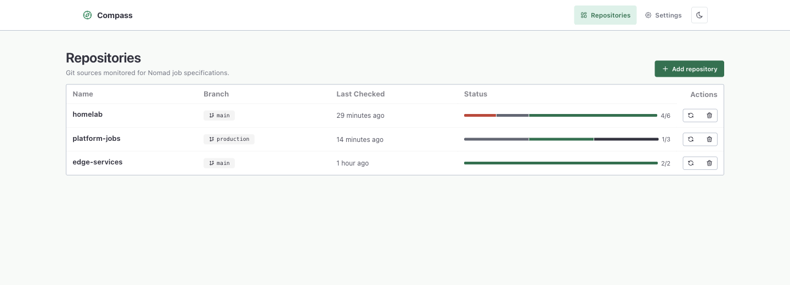
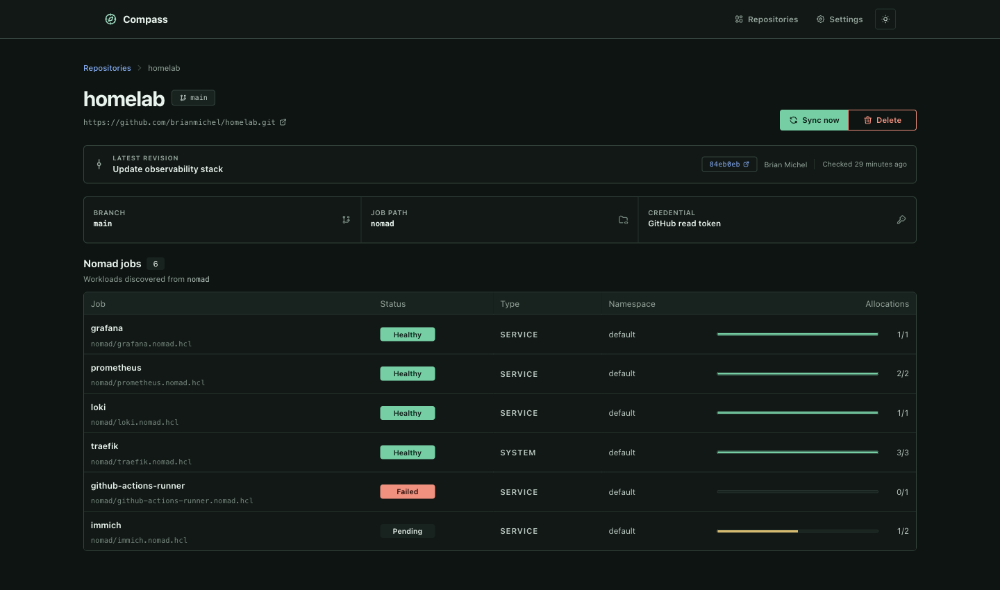

# Nomad Compass

A work in progress gitops reconciler for Nomad.

Nomad Compass is a GitOps reconciler for HashiCorp Nomad. It runs as a single container that hosts a tiny onboarding UI, stores encrypted repository credentials, and continuously syncs Nomad job specifications committed to Git.

## Features

- **Single container** – Vue-powered onboarding UI and Go backend served from the same binary.
- **Secure credential storage** – HTTPS tokens and SSH keys encrypted with a symmetric key supplied via configuration.
- **SQLite persistence** – Lightweight, zero-dependency database managed automatically.
- **Git polling** – Uses `go-git` to clone, fetch, and track `.nomad/*.nomad.hcl` job files or embedded `compass.bundle.hcl` manifests.
- **Nomad integration** – Parses HCL jobspecs and registers them via the Nomad API with commit metadata attached.
- **Embedded bundles** – A `compass.bundle.hcl` manifest can group native Nomad resource bodies with explicit dependencies; jobs, volumes, and ACL policies are reconciled as a bundle.
- **Safe teardown** – Delete repositories or credentials from the UI and optionally purge their Nomad jobs.
- **Extensive metadata** – Jobs are tagged with repository URL, commit SHA, author, and commit title for traceability.
- **Well tested** – Core encryption, storage, reconciliation, and Git plumbing covered by unit tests.

## Screenshots

### Repository overview — light theme



### Monitored jobs — dark theme



## Getting Started

### Tooling with `mise`

This project ships with a `.mise.toml` that pins Go and Node versions. After installing [`mise`](https://mise.jdx.dev/):

```bash
mise install
mise shell
```

### Configuration

Nomad Compass is configured via environment variables:

| Variable | Description | Default |
| --- | --- | --- |
| `COMPASS_HTTP_ADDR` | HTTP listener address | `:8080` |
| `COMPASS_DATABASE_PATH` | Path to SQLite database | `data/nomad-compass.sqlite` |
| `COMPASS_NOMAD_ADDR` | Nomad API address | `http://127.0.0.1:4646` |
| `COMPASS_NOMAD_TOKEN` | Explicit Nomad ACL token override (primarily for local/backward-compatible use) | falls back to `NOMAD_TOKEN` |
| `NOMAD_TOKEN` | Nomad ACL token; automatically populated for tasks using Nomad Workload Identity with `identity { env = true }` | _empty_ |
| `COMPASS_NOMAD_REGION` | Nomad region override | _empty_ |
| `COMPASS_NOMAD_NAMESPACE` | Nomad namespace override | _empty_ |
| `COMPASS_REPO_BASE_DIR` | Directory for cloned repositories | `data/repos` |
| `COMPASS_REPO_POLL_SECONDS` | Polling cadence (seconds) | `30` |
| `COMPASS_CREDENTIAL_KEY` | 32-byte encryption key encoded as 64 hex chars | _required_ |

> ⚠️ The encryption key is mandatory. Generate one with `openssl rand -hex 32`.

### Command-line validation

The binary also exposes a side-effect-free bundle validation command. It parses the manifest, checks dependency ordering, validates supported native Nomad resource bodies, and prints stable spec and manifest hashes. It does not require `COMPASS_CREDENTIAL_KEY`, a database, or a live Nomad cluster:

```bash
go run ./cmd/nomad-compass bundle validate --file example/homelab-compass.bundle.hcl
cat example/homelab-compass.bundle.hcl | go run ./cmd/nomad-compass bundle validate --file -
go run ./cmd/nomad-compass --format json bundle validate --file example/homelab-compass.bundle.hcl
```

To compare two manifests and get a compact change summary, use the offline bundle plan command:

```bash
go run ./cmd/nomad-compass bundle plan \
  --file desired.bundle.hcl \
  --against previous.bundle.hcl \
  --revision a1b2c3d
```

It emits a readable summary with one resource transition per line and a counted plan section. This is a manifest-to-manifest plan; it does not contact Nomad yet.

When the Compass daemon is running, the CLI also exposes the HTTP API operations:

```bash
nomad-compass --format json --server http://127.0.0.1:8080 status
nomad-compass repo list
nomad-compass repo add --name homelab --url https://github.com/example/homelab.git --branch main
nomad-compass repo plan --id 1
nomad-compass repo reconcile --id 1
nomad-compass repo delete --id 1 --unschedule --yes
nomad-compass credential list
nomad-compass credential add --name github --type https-token --token "$GITHUB_TOKEN"
nomad-compass credential delete --id 1 --yes
```

`repo plan` is read-only: it syncs the repository, observes tracked resources in Nomad, and reports create/update/delete/protected/unchanged actions without mutating Compass state or Nomad. Destructive commands require `--yes`; `--unschedule` explicitly requests Nomad resource removal. Global options such as `--format` and `--server` are placed before the command verbs.

### Running locally

1. Install backend dependencies and prepare the database:

    ```bash
    go test ./...
    ```

2. Install frontend dependencies and launch the dev server (optional live reload):

    ```bash
    cd frontend
    npm install
    npm run dev
    ```

   The Vite proxy forwards `/api` requests to the Go backend on port 8080.

   For UI development without a backend or Nomad cluster, run the in-memory demo API instead:

   ```bash
   npm run dev:demo
   ```

   Demo mode includes repositories, credentials, commits, and jobs in healthy, pending, degraded, and failed states. Mutations remain in memory and reset when Vite restarts. Demo code is never included in the production bundle.

3. Build the production bundle and run the Go binary:

    ```bash
    npm run build        # from frontend/
    cd ..
    go run ./cmd/nomad-compass
    ```

### Docker image

Build the container:

```bash
docker build -t nomad-compass .
```

Run it:

```bash
docker run \
  -e COMPASS_CREDENTIAL_KEY=$(openssl rand -hex 32) \
  -e COMPASS_NOMAD_ADDR=http://host.docker.internal:4646 \
  -p 8080:8080 \
  nomad-compass
```

Run it in Nomad

```bash
nomad run \
  -var="credential_key=$(openssl rand -hex 32)" \
  example/nomad-compass.nomad.hcl
```

Mount `/data` or change `COMPASS_DATABASE_PATH`/`COMPASS_REPO_BASE_DIR` if you prefer persistent volumes.

### Embedded bundle manifests

Repositories may place a `compass.bundle.hcl` (or `compass.hcl`) file under the configured job path. The manifest embeds native Nomad HCL bodies and gives Compass a stable resource address:

```hcl
bundle "example" {
  resource "job" "api" {
    datacenters = ["dc1"]

    group "api" {
      task "server" {
        driver = "docker"
      }
    }
  }
}
```

Resources can declare Compass-owned dependencies and deletion behavior with `depends_on` and `delete = "protect"`. Jobs, host/CSI volumes, and ACL policies are currently wired into reconciliation; the parser also reserves names for future resources such as namespaces, node pools, and quotas. Volume and ACL policy resources are protected from deletion by default; use `delete = "allow"` only when replacement or removal is intentional. Resource addresses (`kind.name`) are the stable Compass identities, independent of the bundle file path. Volume body changes require an explicitly allowed replacement. Volume resources require the matching host-volume or CSI ACL capabilities, and ACL policy resources require a management-capable bootstrap token. See `example/homelab-compass.bundle.hcl` for a real homelab-shaped example.

### Repository onboarding workflow

1. Create credentials in the UI (HTTPS token or SSH key). Values are encrypted before hitting disk.
2. Onboard a repository by providing display name, Git URL, branch, optional credential, and the relative path to your job specs (defaults to `.nomad`).
3. Nomad Compass clones the repo and watches every `*.nomad` and `*.nomad.hcl` file inside that path.
4. When new commits land, Compass registers each job with metadata:

   - `nomad-compass/repo-url`
   - `nomad-compass/repo-name`
   - `nomad-compass/job-file`
   - `nomad-compass/commit`
   - `nomad-compass/commit-author`
   - `nomad-compass/commit-title`

Trigger an immediate reconcile via the UI or `POST /api/repos/{id}/reconcile`.

### Testing

Run the Go test suite:

```bash
go test ./...
```

Run the isolated Git → Compass → Nomad E2E test with a Lima/Colima-backed Docker daemon:

```bash
mise run e2e-local
```

To leave the local Nomad and Compass processes running for manual inspection:

```bash
COMPASS_E2E_KEEP_RUNNING=1 mise run e2e-local
```

Vue component tests are not included yet. The backend carries the bulk of logic and has targeted unit coverage.

## Project Layout

```
cmd/nomad-compass     # Application entrypoint
frontend/             # Vue + Vite UI
internal/auth         # Credential encryption helpers
internal/config       # Environment-driven configuration
internal/nomadclient  # Thin Nomad API wrapper
internal/reconcile    # Reconciliation loop
internal/repo         # Git sync and job discovery
internal/server       # HTTP API and SPA hosting
internal/storage      # SQLite persistence layer
internal/web          # Embedded frontend assets
```

## Future Enhancements

- Background webhook receiver to replace polling when SCM supports it.
- Audit log of reconciliation events.
- Pluggable secret backends (Vault, AWS Secrets Manager, etc.).
- Automated e2e pipeline for Docker image smoke testing.
